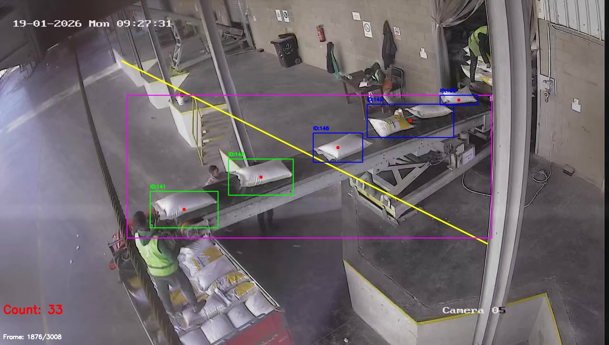

# Bag Counter

Motion-based bag counter for conveyor belts using background subtraction and object tracking with OpenCV.

## Features

- **Motion Detection**: KNN-based background subtraction to detect moving objects
- **Object Tracking**: Centroid tracking across frames with ID assignment
- **Flexible Counting Lines**: 
  - Horizontal counting line
  - Diagonal counting line (matches conveyor angle)
  - Adjustable line length
- **Region of Interest (ROI)**: Define specific area to monitor
- **Duplicate Prevention**: Filters out false counts from bag fragments
- **Video Output**: Annotated output video with bounding boxes and IDs
- **Logging**: Detailed count log with frame information

## Requirements

- Python 3.7+
- OpenCV (`opencv-python`)
- NumPy (`numpy`)
- UltraLytics (`ultralytics`)

## Installation

1. Clone this repository
```bash
git clone https://github.com/mostafaeslam/Bag-Counter.git
cd bag_counter
```

2. Install dependencies
```bash
pip install -r requirements.txt
```

3. Create input and output directories
```bash
mkdir input output
```

## Usage

1. Place your video file in the `input/` directory
2. Update the video path in `main.py`:
```python
VIDEO_PATH = "./input/your_video.mp4"
```

3. Run the counter:
```bash
python main.py
```

## Results Example

### Original Input


### Counted Output



### Parameters

- **LINE_POSITION**: 
  - Horizontal: 0.5 = middle, 0.7 = 70% down
  - Diagonal: slope value (0.5 = y = 0.5*x)

- **MIN_AREA / MAX_AREA**: Filter blobs by size to avoid noise and large objects

- **USE_DIAGONAL_LINE**: Enable diagonal counting line (better for angled conveyors)

- **LINE_LENGTH_RATIO**: Shorten the counting line
  - 1.0 = full width
  - 0.9 = 90% of width (5% margin each side)
  - 0.6 = 60% of width (20% margin each side)

- **ROI**: Define region to monitor
  - Format: (x1, y1, x2, y2) - top-left to bottom-right corners
  - Set to None to use entire frame

## Output

The program generates:

1. **counted_video.mp4**: Annotated video with:
   - Bounding boxes around detected bags
   - Bag IDs
   - Counting line visualization
   - Real-time count display
   - Frame counter

2. **count_log.txt**: Summary of results including:
   - Total frames processed
   - Total bags counted
   - Configuration used
   - List of bag IDs

## How It Works

1. **Motion Detection**: KNN background subtractor identifies moving objects
2. **Morphological Operations**: Clean up noise with CLOSE and OPEN operations
3. **Centroid Extraction**: Find center of each detected blob
4. **Object Tracking**: Match centroids across frames using distance threshold
5. **Counting**: Count objects when they cross the counting line
6. **Deduplication**: Remove false counts from bag fragments

## Tips for Best Results

- **Lighting**: Ensure consistent lighting on the conveyor
- **ROI**: Define ROI to exclude non-conveyor areas
- **Line Position**: Place counting line where bags fully cross it
- **Diagonal Line**: Use for angled conveyors to improve accuracy
- **Area Thresholds**: Adjust MIN_AREA and MAX_AREA based on bag size


## File Structure

```
bag_counter/
├── main.py                # Main application
├── requirements.txt       # Dependencies
├── README.md              # This file
├── Images                 # Results  
├── .gitignore             # Git ignore rules
├── input/                 # Input videos directory
└── output/                # Output results directory
    ├── counted_video.mp4  # Annotated video
    └── count_log.txt      # Results log
```

## Performance

- **FPS**: Processes at video FPS (typically 20-30 FPS on CPU)
- **Resolution**: Tested on 1280x720 and higher
- **Memory**: ~500MB for 1080p video processing

# feel free to use and modify

## Author
 
Mostafa Eslam 
